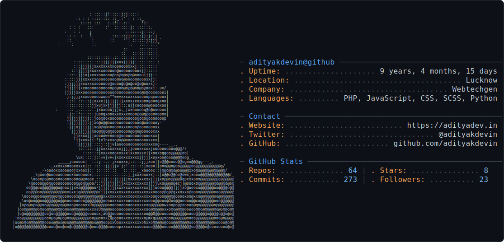
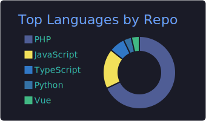
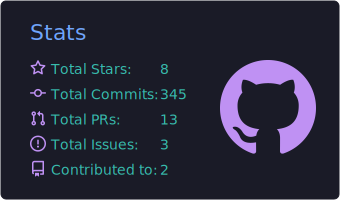
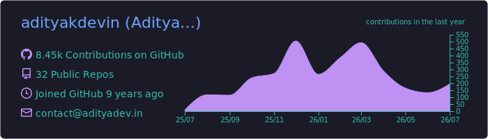

<picture>
  <source media="(prefers-color-scheme: dark)" srcset="dark_mode.svg" />
  <source media="(prefers-color-scheme: light)" srcset="light_mode.svg" />
  
</picture>

<div align="center">


</div>

# Aditya Kumar `adityakdevin`

> **Full Stack Developer & AI Engineer** · Tech Lead @ MM Novatech · 7+ years · Lucknow, India 🇮🇳

```bash
$ whoami
```

```yaml
name:        Aditya Kumar (adityakdevin)
role:        Tech Lead @ MM Novatech
experience:  7+ years building web platforms & AI-powered products
location:    Lucknow, Uttar Pradesh, India
website:     https://adityadev.in
focus:
  - Full Stack Engineering:  Laravel · Vue/Nuxt · React/Next.js · Tailwind
  - AI Engineering:          LLM apps · RAG pipelines · AI chatbots · automation
  - Architecture & DevOps:   solution design · CI/CD · cloud infrastructure
currently:   shipping AI features into client products & building open-source LLM tools
ai_native:   I build WITH AI (Claude Code, Copilot) and build AI INTO products
open_to:     Tech Lead roles · AI + Laravel freelance projects · OSS collaboration
```

```bash
$ ls ~/skills
```

### Backend & AI

<p>


</p>

### Frontend

<p>


</p>

### Data & DevOps

<p>


</p>

```bash
$ cat featured-work.md
```

| Project | What it is | Stack |
|---|---|---|
| 🤖 **AI client integrations** | LLM-powered chatbots, RAG pipelines & workflow automation shipped into production client products (private code — ask me about it) | OpenAI · Claude · LangChain · Laravel |
| 💰 **[BudgetGen](https://github.com/adityakdevin/budgetgen)** | Smart personal finance manager — budgets, tracking, reports | PHP · Laravel · MySQL |
| 💳 **Payments & integrations** | [Stripe payments](https://github.com/adityakdevin/stripe-payments) · [Razorpay for WooCommerce](https://github.com/adityakdevin/razorpay-woocommerce) · [AWS S3 uploads](https://github.com/adityakdevin/s3upload) · [PDF watermarking](https://github.com/adityakdevin/add-watermark-pdf) | PHP · Stripe · Razorpay · AWS |
| 🏠 **[Remax Millennium](http://remaxmillennium.ca)** | Real-estate platform for a Canadian brokerage — led development end to end | Full Stack |

```bash
$ git log --stat adityakdevin
```

<div align="center">








</div>

### 🐍 Contribution snake


```bash
$ tail -f ~/blog/latest.log
```

<!-- BLOG-POST-LIST:START -->
🚧 Fresh posts land here automatically once published on [dev.to/adityakdevin](https://dev.to/adityakdevin)
<!-- BLOG-POST-LIST:END -->

```bash
$ ping adityakdevin
```

<div align="center">

<a href="https://adityadev.in"></a>&nbsp;
<a href="mailto:contact@adityadev.in"></a>

<a href="https://www.linkedin.com/in/adityakdevin"></a>&nbsp;
<a href="https://twitter.com/adityakdevin"></a>&nbsp;
<a href="https://dev.to/adityakdevin"></a>&nbsp;
<a href="https://www.twitch.tv/adityakdevin"></a>

<br/>

### 💼 Open to


Fastest way to reach me → [**contact@adityadev.in**](mailto:contact@adityadev.in)

<br/>

<a href="https://www.buymeacoffee.com/adityakdevin"></a>

<br/><br/>


</div>

---

<div align="center">


<sub>Aditya Kumar (<b>adityakdevin</b>) — Full Stack Developer & AI Engineer from Lucknow, India. Laravel · Vue · React · Next.js · Python · LLM apps · RAG · AI automation. → <a href="https://adityadev.in">adityadev.in</a></sub>

</div>
